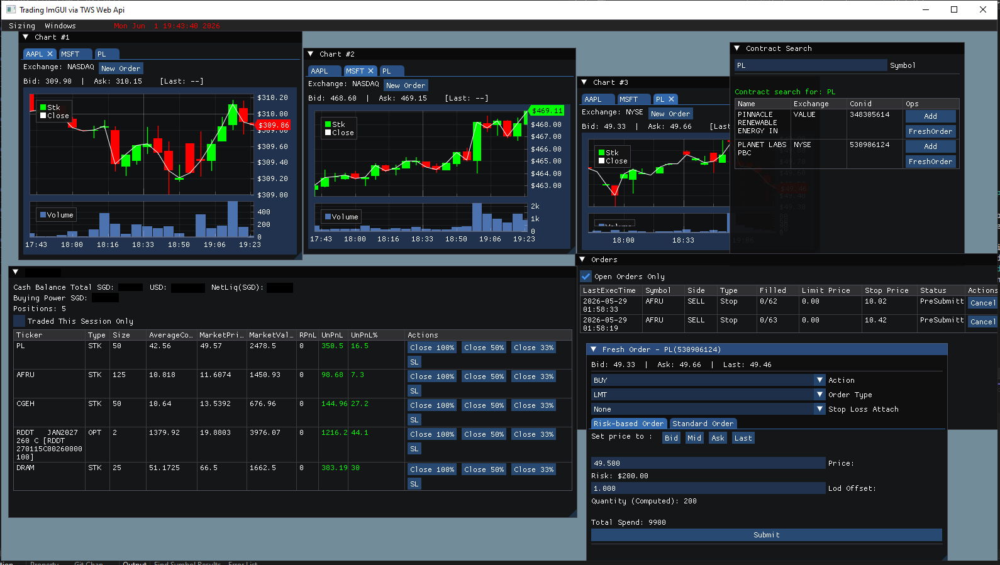

# Trading imgui (via TWS Web Api)

Trading with IMGUI view. Contract search, risk-based orders, position order/management, stock charts.

*I have a version with intraday scanners, and scanners utilizing @jfsrev's methods of ATR extension, plus a number of extra features and automated trading, leave a message if you need it. It won't be free though.*

TWS Documentation: https://interactivebrokers.github.io/cpwebapi/quickstart

TWS Web Api: https://www.interactivebrokers.eu/campus/ibkr-api-page/cpapi-v1/#accounts

Windows/Directx11 requirement.

## Setup & running

- Download java https://www.java.com/en/download/ and install it. `java --version` to see if it works

- Download https://download2.interactivebrokers.com/portal/clientportal.gw.zip and unzip it.

- Open a cmd prompt in the unzipped folder and run `bin\run.bat root\conf.yaml`

- Open https://localhost:5000 on a web browser, skip the ssl insecure notice. You should see a IBKR login screen, login. The message 'Client login succeeds' will be displayed if the login is successful.

- Run the program `bin/trading_imgui_tws_webapi.exe`. It will make webapi calls through this medium

- Optionally, can test with `curl --url https://localhost:5000/v1/api/iserver/auth/status --request GET -k`

## Code guidelines & information

- This software uses a loop that runs infinitely. Within the loop, it processes all coroutinues `process_coroutines()` until they yield() or they terminate. This is useful for api calls where you have to wait, allowing you to pause execution and work on some other task.

- All coroutine/api calls to the TWS Web Api are located in `im_api.cpp/h`

- All immediate mode gui user code and custom state management is in `trading_imgui.cpp/h`. We also use `implot` to draw charts.

- Other single-file libraries are in `naett` for OS based https calls, and `parson` for json parsing. Coroutines uses `minicoro.h` for stackful coroutines.

